##############################################################################
Chapter 2 Assemble Robot
##############################################################################

If you have any concerns, please feel free to contact us at support@freenove.com

It is recommended to assemble and use the robot dog according to the tutorial. Otherwise, there may be installation errors, device damage, etc. 

:red:`Don't reverse batteries. Or the board will be damaged.`

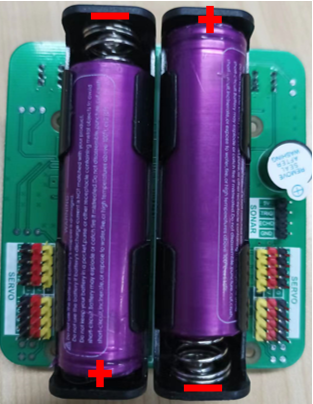

Step 1 Install Disk Servo Arms
****************************************************************

Take out 12 disk servo arms from the servo packages. 

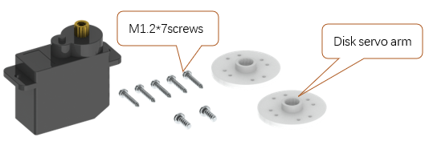

There are 4 pairs of opposite holes on the disk servo arm, and the distance between each pair is different. 

Please use the 2 pairs of holes with longer distance.

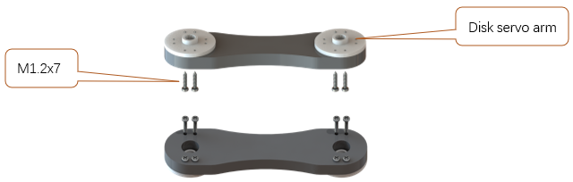

M1.2*7 screws are contained in following plastic bag. :red:`If a package of M1.2*7 self-tapping screws cannot be found, it may be packed in the servo package.`

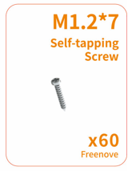

|

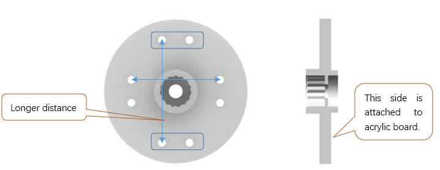

Get following 4 parts.

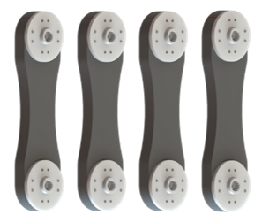

|

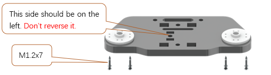

|

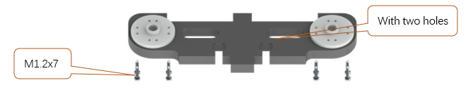

Step 2 Install Body Bracket
****************************************************************

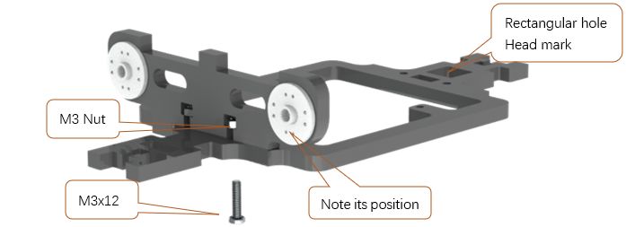

|

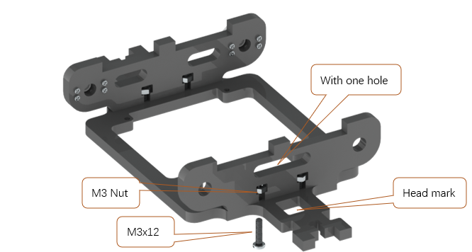

|

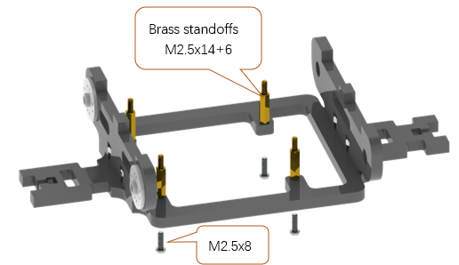

Step 3 Install Shield
****************************************************************

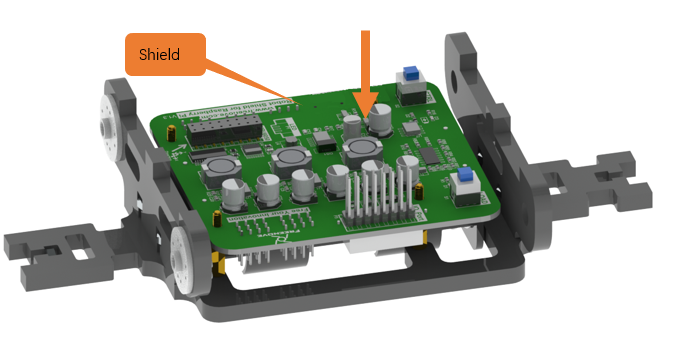

|

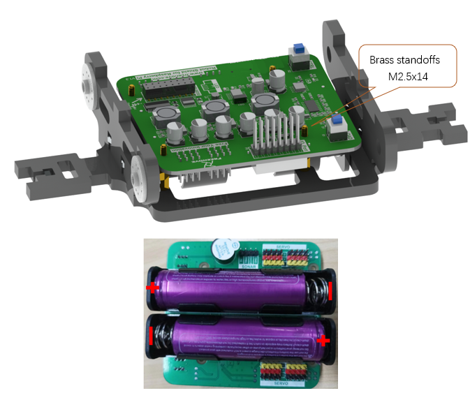

Step 4 Install MPU6050
****************************************************************

.. note:: 

    There are two rows of headers. Plug the MPU6050 into the outer Row. 

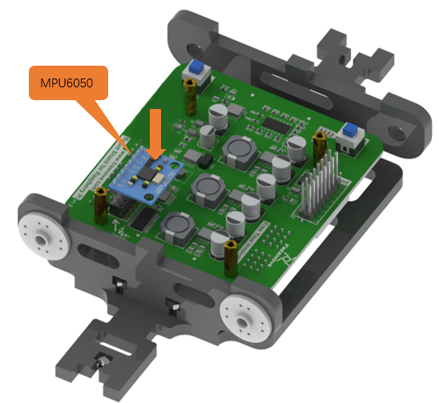

Step 5 Install LED module
****************************************************************

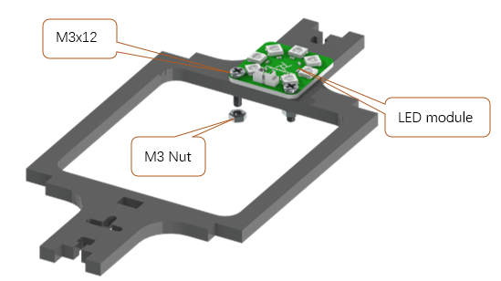

Install the top bracket.

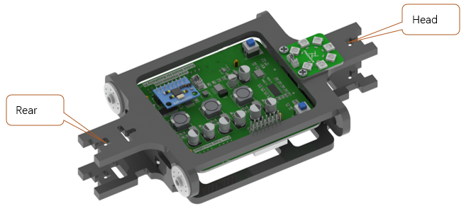

Connect shield with LED module.

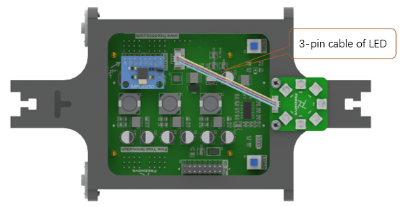

This step will be very helpful for later assembly.

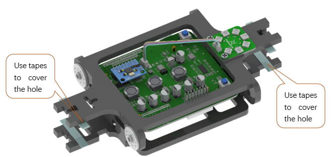

Step 6 Install Raspberry Pi
****************************************************************

Attach the Raspberry PI to the robot dog with four M2.5x8 screws.

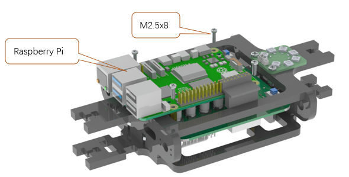

Step 7 Install Connector
****************************************************************

Install connector to connect Raspberry Pi and shield.

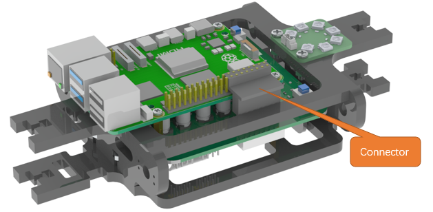

:red:`We have two types of connection boards, but they are installed in the same way.`

